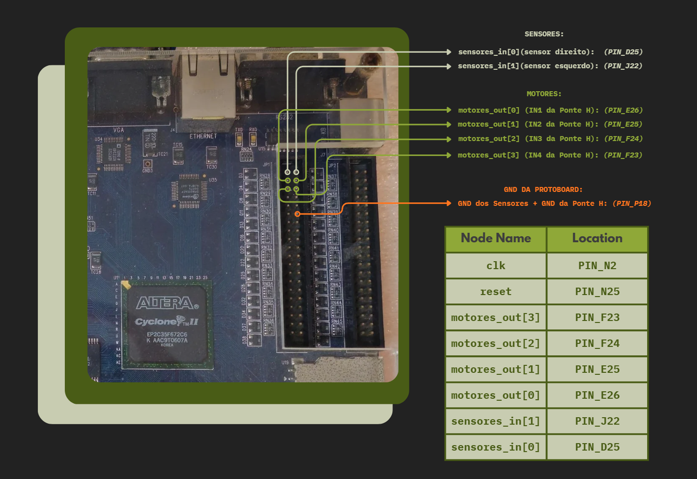
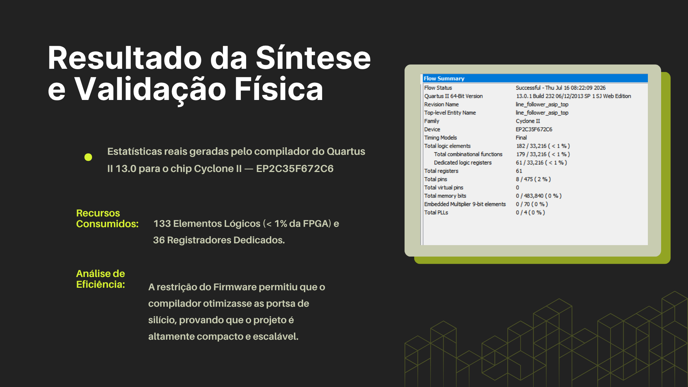

# Application-Specific Instruction-set Processor (ASIP) para Robô Seguidor de Linha

Este repositório contém o código-fonte em **Verilog** e a documentação de um microprocessador de ciclo único desenvolvido sob medida para o controle de um robô seguidor de linha autônomo. O processador foi desenvolvido por mim como projeto final para a disciplina de Sistemas Digitais (COMP0514) da Universidade Federal de Sergipe (UFS).

O objetivo principal deste projeto é entender na prática como funciona o DataPath de um processador, compreendendo como que 'um arranjo estruturado de silício' consegue interpretar estímulos do mundo externo, realizar tomadas de decisões lógicas e transformá-las em ações.

---

## 1. Visão Geral e Materiais

O ASIP atua como o "cérebro" do robô, sendo responsável por ler continuamente os estados dos sensores reflexivos, processar a lógica de desvio e enviar sinais de acionamento para a ponte H que controla os motores DC.

### Materiais Utilizados

**Hardware:**
* 1x Placa de Desenvolvimento FPGA Altera DE2 (Cyclone II EP2C35F672C6);
* 2x Sensores Ópticos Reflexivos Infravermelhos (Módulo TCRT5000);
* 1x Módulo Ponte H Dupla (L9110S);
* 1x Chassi Robótico 2WD;
* 2x Motores DC (com caixa de redução);
* 1x Protoboard de 170 furos;
* 1x Fonte de Alimentação Externa (com 4 pilhas de 1,5V associadas em série);
* Múltiplos Jumpers para interconexão.

**Software e Ferramentas:**
* Quartus II 13.0 Web Edition (Síntese, Análise e Roteamento);
* TimeQuest Timing Analyzer;
* Quartus Programmer (Gravação via USB-Blaster);

 

---

## 2. Arquitetura e Módulos do Processador

### Diagrama do Datapath

Abaixo está a representação visual do caminho de dados (Datapath) e da Unidade de Controle do processador, ilustrando o fluxo de informações em um ciclo de instrução.

O hardware foi descrito de forma estrutural e modular em Verilog, resultando em uma **Arquitetura Harvard** simplificada de **Ciclo Único** de 8 bits, com instruções de 16 bits.

* **Program Counter (`pc_asip.v`):** Registrador sequencial que armazena o endereço da instrução atual. Atualiza para `PC + 1` a cada ciclo de clock ou carrega um endereço de salto condicional proveniente da instrução `BEQ`.
* **Memória de Instruções (`rom_asip.v`):** Memória combinacional de leitura (256x16 bits). Carrega o código de máquina do arquivo `firmware.txt` através da função `$readmemb` e fornece as instruções para a Unidade de Controle.
* **Unidade de Controle (`controle_asip.v`):** Lógica combinacional que decodifica o Opcode de 4 bits (`instrucao[15:12]`) e gera os sinais de controle essenciais (`reg_escrever`, `ula_src`, `mem_to_reg`, `branch`, etc.) para rotear os multiplexadores do Datapath.
* **Register File (`banco_reg_asip.v`):** Composto por 4 registradores de 8 bits (`R0` a `R3`). O `R0` é utilizado exclusivamente para armazenar o valor estático `0`, enquanto `R1`, `R2` e `R3` são registradores de propósito geral.
* **Unidade Lógica e Aritmética (`ula_asip.v`):** Realiza operações de soma, subtração e operações lógicas bit a bit (AND, XOR). Gera a flag de status `Flag_Zero` utilizada nas tomadas de decisão de salto.
* **Módulo de I/O (`io_asip.v`):** Interface de memória mapeada (Memory-Mapped I/O). Isola o Datapath do mundo exterior, roteando dados para endereços físicos (`8'h10` para leitura dos sensores e `8'h20` para escrita nos motores).
* **Top-Level (`line_follower_asip_top.v`):** Módulo principal que instancia e interconecta todos os submódulos descritos acima utilizando barramentos e define os multiplexadores estruturais de roteamento lógico.

---

## 3. Conjunto de Instruções (ISA) e Firmware

O processador foi projetado com um Conjunto de Instruções (ISA) contendo 8 instruções essenciais. A estrutura da instrução de 16 bits é particionada da seguinte forma:  
`[Opcode: 4 bits] | [Reg. Destino: 2 bits] | [Reg. Origem: 2 bits] | [Imediato: 8 bits]`

| Mnemônico | Opcode | Descrição |
| :--- | :--- | :--- |
| `LOAD` | `0001` | Lê dados do I/O (sensores) para um registrador. |
| `STORE` | `0010` | Envia dados de um registrador para o I/O (motores). |
| `ADD` | `0011` | Soma algébrica entre registradores. |
| `SUB` | `0100` | Subtração (útil para comparações). |
| `AND` | `0101` | Máscara lógica. |
| `XOR` | `0110` | Operação lógica Ou Exclusivo. |
| `BEQ` | `0111` | Desvio condicional baseado na `Flag_Zero`. |
| `LOADI` | `1000` | Carrega um valor constante (8 bits) diretamente no registrador. |

O código de máquina executado pela FPGA está localizado no arquivo `firmware.txt`. Ele implementa um loop infinito que lê os dados dos sensores `TCRT5000` e atua sobre os motores, garantindo microcorreções de trajetória (sprint para frente, curva à esquerda, curva à direita e modo de busca).

---

## 4. Implementação em Hardware: FPGA Cyclone II

O projeto foi sintetizado e validado fisicamente utilizando a placa Altera DE2 (Cyclone II - EP2C35F672C6). 

### Mapeamento Físico e Pinagem

A compilação do Top-Level utilizou o Pin Planner para fixar as interfaces lógicas aos pinos de GPIO de expansão da placa, garantindo o isolamento elétrico e a correta transmissão de sinais.

### Roteamento e Síntese

O processo de Análise e Síntese otimizou o código em RTL gerando o seguinte relatório de consumo de recursos de hardware do dispositivo:

A gravação do arquivo `.sof` (SRAM Object File) na FPGA foi conduzida através da interface USB-Blaster e gerenciada pela ferramenta Programmer do Quartus II.

---

## 5. Conclusão e Trabalhos Futuros

A execução deste projeto permitiu consolidar, de forma prática, o entendimento sobre o funcionamento interno de um processador, desmistificando o papel do DataPath como o coração da unidade central de processamento.

Ficou evidente como um arranjo estruturado de silício — inicialmente apenas um conjunto de transistores e portas lógicas — é capaz de decodificar e interpretar estímulos elétricos do mundo externo. Através do sincronismo dos sinais de controle e do fluxo correto dos dados, observou-se na prática como esses estímulos brutos são transformados em tomadas de decisões lógicas complexas e, finalmente, convertidos em ações físicas e computacionais concretas. 

**Possíveis Melhorias Arquiteturais e Futuras Implementações:**
1.  **Pipelining:** Implementação de múltiplos estágios no ciclo de instrução (Busca, Decodificação, Execução) para elevar a frequência de operação máxima do relógio.
2.  **Modulação por Largura de Pulso (PWM) em Hardware:** Adição de módulos divisores de clock na camada de I/O para controlar de forma dinâmica e granular a tensão enviada à Ponte H, suavizando as curvas do robô.
3.  **Controle PID:** Alteração do firmware e da capacidade de ALU para implementar cálculo Proporcional-Integral-Derivativo, permitindo leitura de arranjos de sensores em barra e alcançando altas velocidades de pista.

---

## 6. Referências

Por escrito, caso queiram pesquisá-las:

1.  **PATTERSON, D. A.; HENNESSY, J. L.** *Computer Organization and Design: The Hardware/Software Interface*. 5. ed. Elsevier, 2014.
2.  **HARRIS, D.; HARRIS, S.** *Digital Design and Computer Architecture*. 2. ed. Morgan Kaufmann, 2012.
3.  **THOMAS, D.; MOORBY, P.** *The Verilog Hardware Description Language*. 5. ed. Springer Science & Business Media, 2008.
4.  **IEEE Standard for Verilog Hardware Description Language** (IEEE Std 1364-2001).

---

*Projeto acadêmico desenvolvido por [Mateus Aranha](https://github.com/matt-aranha) para fins educacionais na disciplina de Sistemas Digitais.*   **© 2026. All rights reserved.**
